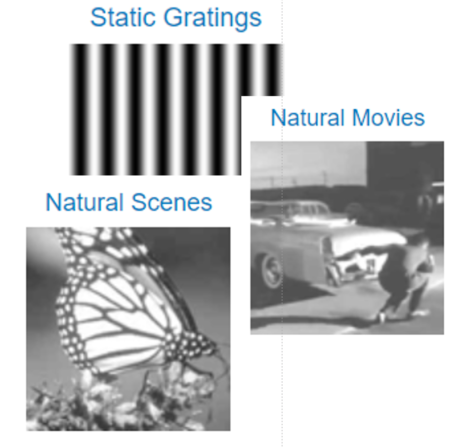

# Example NWB:N Data

This is a list of example NWB:N files. This is not a comprehensive list
and provided as a convenience. Many of the datasets and tools are built
and supported by other groups, and are in active development.

**Disclaimer:** Reference herein to any specific data, product, process, or service by its trade name, trademark, manufacturer, or otherwise, does not constitute or imply its endorsement, recommendation, or favoring by the NWB:N development team, United States Government or any agency thereof, or The Regents of the University of California. Use of the NeurodataWithoutBorders name for endorsements is prohibited.

## Allen Institute for Brain Science: pre-release (May, 2019)

A collection of *pre-release* example datasets is available for
download [here](http://download.alleninstitute.org/informatics-archive/prerelease/):
*   Passive viewing extracellular electrophysiology
*   Visual behavior calcium imaging 
*  Intracellular in-vitro electrophysiology 

## Frank Lab (UCSF) (May, 2019)

A version of Frank Lab HC06 dataset from CRCNS.org (see the [dataset about page](https://crcns.org/data-sets/hc/hc-6/about-hc-5)) is available at [Bon04.nwb](https://www.dropbox.com/s/92jkkse2c7lm7qe/bon04.nwb?dl=0) (~4GB). The NWB:N file is created by [create_franklab_nwbfile.ipynb](https://github.com/LorenFrankLab/franklab-nwb-hack/blob/master/hackathon-6/create_franklab_nwbfile.ipynb). The [franklab-nwb-hac](https://github.com/LorenFrankLab/franklab-nwb-hack/tree/master/hackathon-6) repository also contains additional notebooks demonstrating query and analysis of this dataset as well of the ecephys_session_785402239.nwb  file from the May, 2019 Allen Institute for Brain Science: pre-release above.

## Buzsaki Lab (NYU) (May, 2019)
Electrophysiology recordings from hippocampal regions of mice in theta-maze and in open exploration, from [Senzai, Yuta, and György Buzsáki. "Physiological properties and behavioral correlates of hippocampal granule cells and mossy cells." Neuron 93.3 (2017): 691-704.](http://www.buzsakilab.com/content/PDFs/Senzai2017Neuron.pdf)

Data can be found [here](https://buzsakilab.nyumc.org/datasets/NWB/SenzaiNeuron2017/) and is in beta-release (data is correct but file organization may change slightly).

## PyNWB Test Data

PyNWB generates as part of its test suite a collection of small NWB:N files with synthetic test data. The files generated by the tests are available [here](https://drive.google.com/drive/folders/1g1CpnoMd9s9L-sHBWVyklp3-xJcLGeFt?usp=sharing)
