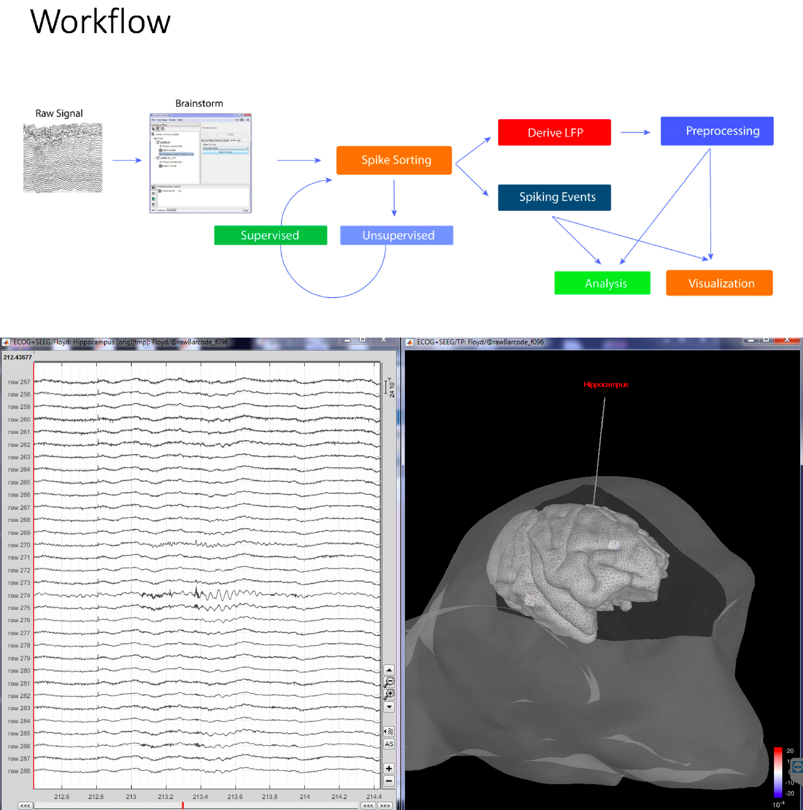

# Analysis and Visualization Tools for NWB:N

This is a list of tools we are cataloging as a convenience reference for NWB:N users. This
is not a comprehensive list of NWB:N tools. Many of these tools are built and supported by
other groups, and are in active development.

**Disclaimer:** Reference herein to any specific product, process, or service by its trade name, trademark, manufacturer, or otherwise, does not constitute or imply its endorsement, recommendation, or favoring by the NWB:N development team, United States Government or any agency thereof, or The Regents of the University of California. Use of the NeurodataWithoutBorders name for endorsements is prohibited.

## [Brainstorm](https://neuroimage.usc.edu/brainstorm/Introduction)
<html>
  <table border="0">
    <tr>
      <td>Brainstorm is a collaborative, open-source application dedicated to the analysis of brain recordings:
MEG, EEG, fNIRS, ECoG, depth electrodes and animal invasive neurophysiology built in Matlab and Java. Brainstorm now supports the NWB data format for importing ECoG and invasive electrophysiology data. The application provides a graphical interface for a preprocessing and analysis pipeline, including spike sorting using WaveClus, UltraMegaSort2000, KiloSort or Klusters, a large suite of spiking and LFP analyses, data visualization, and interactive visualization of anatomical topographies.</td>
      <td></td>
    </tr>
  </table>
</html>

## [NWBwidgets](https://github.com/NeurodataWithoutBorders/nwb-jupyter-widgets)
<html>
  <table border="0">
    <tr>
      <td></td>
      <td>NWBwidgets is a library for exploring an NWB file in a Jupyter notebook. This tool lets you travese the hierarchical structure of an NWB file and visualize the data from each of the NWB elements within the file.</td>
    </tr>
  </table>
</html>
  
## [EcogVIS](https://github.com/bendichter/ecogVIS)
<html>
  <table border="0">
    <tr>
      <td></td>
      <td>EcogVIS is a python based, timeseries visualizer for Electrocorticography (ECoG) signals stored in NWB files. EcogVIS makes it intuitive and simple to viualize ECoG signals from selected channels, brain regions, make annotations and mark intervals of interest. Signal processing and analysis tools will soon be added.  </td>
    </tr>
  </table>
</html>